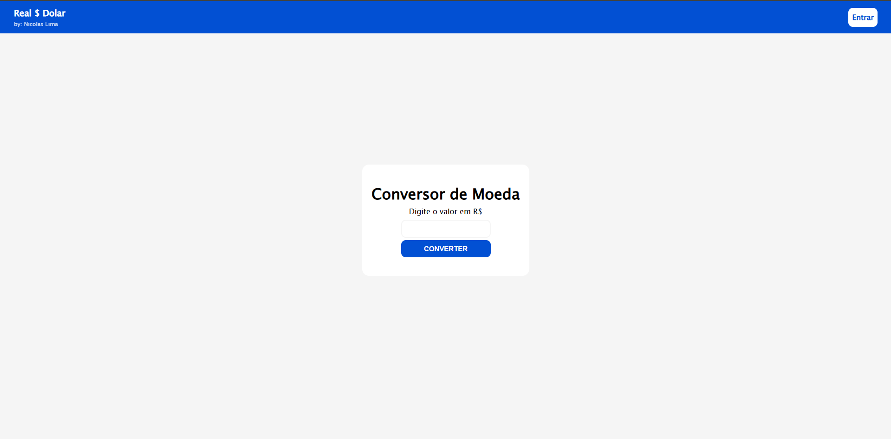
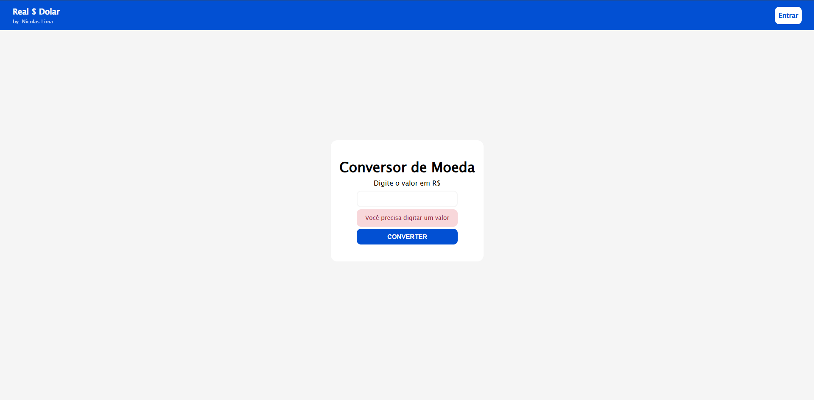
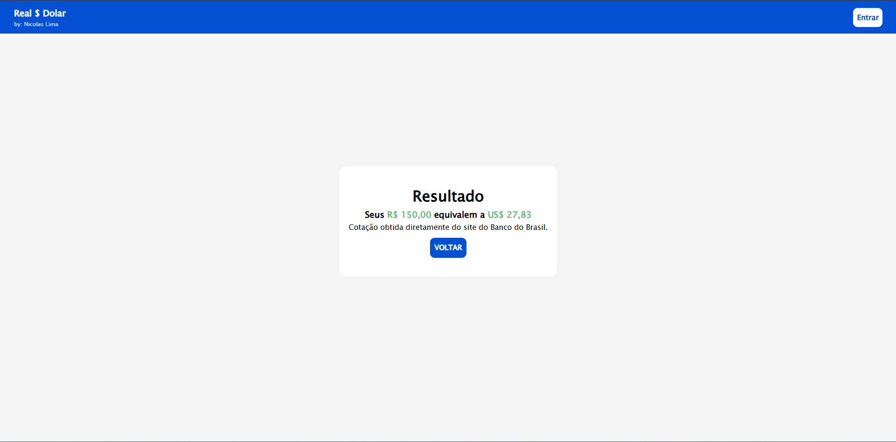

# PHP – Conversor de Moeda (BRL → USD)

Este projeto é um conversor de moeda que transforma valores em **Real (BRL)** para **Dólar (USD)**, utilizando a cotação atualizada diretamente da **API do Banco Central do Brasil**.  
Além disso, o projeto utiliza a extensão **Intl** do PHP para formatação monetária, garantindo clareza e padronização nos valores exibidos.

A validação do formulário é feita com **JavaScript**, garantindo que o usuário informe valores válidos antes da conversão.

---

## 🔧 Requisitos

Para rodar este projeto, você precisa de um ambiente com suporte a PHP.  
Você pode usar:

- **XAMPP** (recomendado para iniciantes)
- WAMP / MAMP / Laragon
- Extensão **php-intl** ativada
- Ou o servidor embutido do PHP

---

## 🚀 Como executar o projeto

Para rodar o projeto na sua máquina, siga os passos abaixo:

1. **Clonar o repositório**
   ```bash
   git clone https://github.com/NicolasLimaDEV/PHP-Conversor-de-Moeda.git
   ```

2. **Entrar na pasta do projeto**
   ```bash
   cd PHP-Conversor-de-Moeda
   ```

3. **Iniciar o servidor PHP**  
   Caso não esteja usando XAMPP:
   ```bash
   php -S localhost:8000
   ```

4. **Abrir no navegador**
   ```
   http://localhost/PHP-Conversor-de-Moeda/index.php
   ```

---

## 🗂️ Estrutura de Pastas

```
PHP-Conversor-de-Moeda/
├── index.php
├── conversor.php
├── script.js
├── style.css
├── assets/
│   └── screenshots/
│       ├── screenshot-1.png   # Tela inicial
│       ├── screenshot-2.png   # Tela de erro
│       └── screenshot-3.png   # Resultado convertido
└── README.md
```

---

## 🖼️ Screenshots do Projeto

### 📌 Tela inicial


### 📌 Tela de erro (validação)


### 📌 Tela com o valor convertido


---

## ✨ Tecnologias Utilizadas

- **PHP**
  - Consumo da API do Banco Central (Bacen)
  - Intl (Internationalization) para formatação monetária
- **JavaScript**
  - Validação de formulário
- **HTML / CSS**
  - Estrutura e estilização do projeto
- **API do Banco Central do Brasil**
  - Cotação USD-BRL atualizada em tempo real

---

## 📬 Contato

Criado por **Nicolas Lima**  
GitHub: https://github.com/NicolasLimaDEV
Linkedin: https://linkedin.com/in/nicolaslimadev

